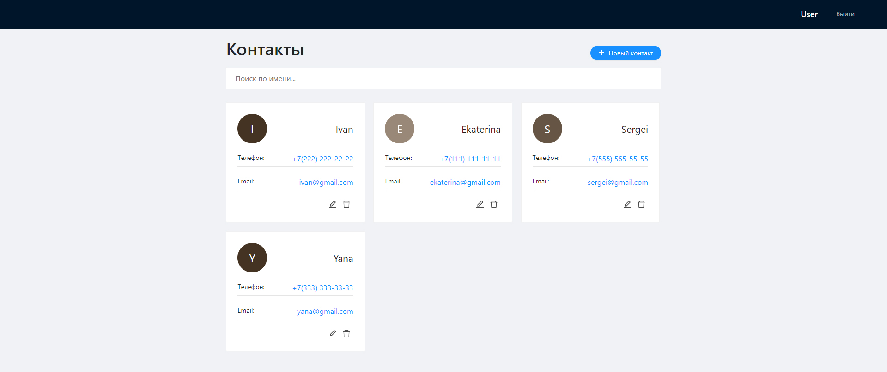

# Тестовое задание
Приложение состоит из двух страниц. Страница входа и страница личного кабинета, где имеется список контактов. Карточки контактов можно удалять, редактировать и добавлять новые;

## Страница входа

В полях ввода работает валидация. При некорректных данных выводятся ошибки. После входа имя пользователя и булевое значение аутентификации сохраняется в *local storage*.
Для входа в личный кабинет следует использовать следующие данные:

##### Логин: *`user`*
##### Пароль: *`password`*

## Страница пользователя

На данной странице реализована функция редактирования, добавления и изменения текущих контактов. Во время редактирования и добавления работает валидация в полях ввода;

## Запуск приложения

### `yarn start`
